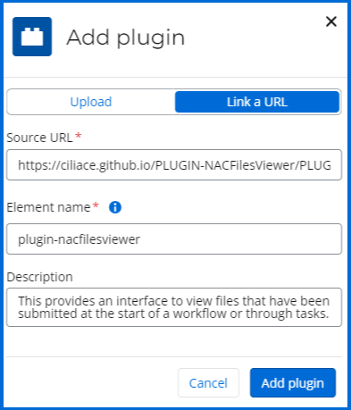

# NAC Files Viewer Plugin

This `NAC Files Viewer` plugin is designed for **Nintex Automation Cloud** and provides an interface to view files that have been submitted at the start of a workflow or through tasks.

## Features

- Support for viewing files from start or tasks within a workflow instance.
- Filter files by users and tasks.
- View and download supported file types.
- Localized in English, French, German, and Spanish.

## Installation

To install the plugin on Nintex Automation Cloud : 

1. Open your tenant Nintex Automation Cloud:
2. From the navigation, select **Automate** > **Forms plugins**, and click **Add plugin**
3. Select **Link to URL** and fill the properties as below :

| **Information**    | Details                                                                                                  |
|----------------|----------------------------------------------------------------------------------------------------------|
| **Source URL**     | [https://ciliace.github.io/PLUGIN-NACFilesViewer/PLUGIN-NACFilesViewer.min.js](https://ciliace.github.io/PLUGIN-NACFilesViewer/PLUGIN-NACFilesViewer.min.js) |
| **Element Name**   | `plugin-nacfilesviewer`                                                                                  |
| **Description**    | This provides an interface to view files that have been submitted at the start of a workflow or through tasks. |

4. Click **Add plugin**

## Usage

Once installed,

